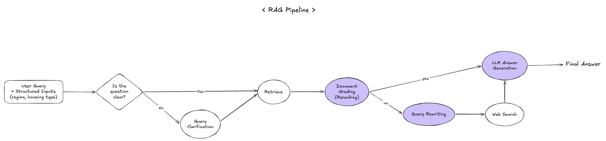

<h1 align="center">BBUmate 👰🏻🤵🏻</h1>

<p align="center">
  <strong>A production-grade RAG chatbot that consolidates Korean newlywed-support policies scattered across 5+ government agencies.</strong>
  <br/>
  Self-correcting retrieval pipeline · Bilingual (KR / EN) via a single backend · Cloud Run + Vercel.
</p>

<p align="center">
  
  
  
  
  
  
  
</p>

<p align="center">
  <a href="https://bbumate-fe.vercel.app">Live demo</a>
  &nbsp;·&nbsp;
  <a href="#the-rag-pipeline">Pipeline deep-dive</a>
</p>

---

## Demo

https://github.com/user-attachments/assets/cb10a4b0-237d-4ad0-a2f7-9fbfa4297a26

---

## The Problem

Korean newlywed support policies are real money — housing subsidies, jeonse loans, tax credits, parental benefits — but the information is scattered across dozens of agencies, each with its own terminology and update cycle.

### What BBUmate does

- **Purpose** — Consolidates fragmented policy info into a single AI counselor that recommends programs tailored to the user's region, housing, and life stage.
- **User flow** — Onboarding (region · housing) → ask a question → RAG retrieves & grades primary sources → grounded answer with **clickable citations**.

### Why it's worth building

1. **Fragmented sources.** Users have to crawl the Housing & Urban Fund, Ministry of Health & Welfare, MyHome Portal, and dozens of municipal sites to piece together the same policy. Inconsistent terminology between agencies means even patient users misread eligibility.
2. **Source-grounded counseling.** Public data APIs, official notices, and press releases are embedded into a vector DB; every answer renders the document it was derived from, so users can verify before acting.

---

## At a Glance

|                              |                                                                                            |
| ---------------------------- | ------------------------------------------------------------------------------------------ |
| **Policy domains indexed**   | 5 (housing, loans, family welfare, corporate benefits, tax)                                |
| **ChromaDB chunks**          | 1,130 chunks · ~37 MB · embedded at build time                                             |
| **Retrieval pipeline**       | 6-stage self-correcting RAG (validate → retrieve → grade → generate → web-search fallback) |
| **Median pipeline latency**  | ~1.8 s LLM-bound on the happy path; ~10 s on the full web-search fallback                  |
| **Tokens / query (typical)** | ~1.3 k                                                                                     |
| **Languages**                | Korean documents, bilingual responses via a `lang` request parameter                       |
| **Deployment**               | Google Cloud Run (Tokyo) · GitHub Actions CI/CD · Vercel for the FE                        |

---

## The RAG Pipeline

<p align="center">
  
</p>

A vanilla "retrieve → generate" pipeline drops too much factual detail and fabricates URLs. The deployed pipeline is six stages, each with an explicit fail-safe.

| #   | Stage                                             | What it does                                                                                                                | Why it's here                                                                                                        |
| --- | ------------------------------------------------- | --------------------------------------------------------------------------------------------------------------------------- | -------------------------------------------------------------------------------------------------------------------- |
| 1   | **Validation**                                    | Two-axis check — _domain_ (is this about newlywed/family welfare policy?) and _clarity_ (is the question answerable as-is?) | Reject off-topic queries cleanly before paying for retrieval; ask one clarifying question for ambiguous inputs.      |
| 2   | **Retrieve**                                      | Top-_k_=3 over a unified Chroma collection, with the user's region/housing context appended to the embedded query           | k=3 keeps prompt length tight; the unified collection avoids domain-routing brittleness.                             |
| 3   | **Grade**                                         | LLM-as-judge filters chunks by per-document relevance                                                                       | Single irrelevant chunk poisons the answer; this step measurably reduces hallucinated benefit amounts.               |
| 4   | **Generate (docs)**                               | GPT-4 answers grounded strictly in graded chunks, with a fixed markdown format (bold money/rates, sentence-per-line)        | The strict format lets the frontend render answers consistently; the "answer only from context" rule prevents drift. |
| 5   | **Drift detection**                               | Detects "no information available" patterns in the generated answer (Korean and English variants)                           | Catches the case where the LLM correctly _recognized_ the gap — and triggers the fallback path.                      |
| 6   | **Fallback (rewrite → web search → re-generate)** | Re-writes the query for web search, calls Tavily, re-generates from web results                                             | Lets the bot answer newly-introduced programs that aren't in the indexed corpus, without polluting the vector DB.    |

**Per-stage latency (representative trace, slowest path):**

```
Clarification   0.95 s
Retrieve        0.95 s
Grade           1.39 s
Rerank          0.01 s
Decision        2.30 s
Rewrite         0.52 s
WebSearch       1.79 s
Generate        3.30 s
─────────────────────
Total          ~11.2 s   (fallback path)
~1.8 s         (happy path: 1-2-3-4 only, GPT-4 generation dominates)
```

---

## Engineering Decisions & Trade-offs

The interesting parts. Each decision below has a defensible alternative I rejected.

<details open>
<summary><strong>1. Bake ChromaDB into the Docker image at build time</strong></summary>

- **Alternative considered:** Pinecone / Weaviate / a long-running ChromaDB service.
- **Decision:** Run `run_ingestion.py` during `docker build`, ship the persisted `chroma_storage/` inside the image.
- **Cost:** ~37 MB image overhead, ~3 min added to each build.
- **Win:** No managed vector-DB bill, no separate scaling story, no schema-drift between code and data. Every Cloud Run revision is a self-contained snapshot of "code + data", so rollback is `gcloud run services update-traffic`. The corpus is small (1,130 chunks) and updated by humans — exactly the regime where build-time bake-in dominates.
</details>

<details>
<summary><strong>2. Rule-based clarity check before the LLM-based validator</strong></summary>

- **Alternative considered:** Always call the LLM validator.
- **Decision:** Cheap keyword + length heuristic short-circuits the validator for unambiguous queries; LLM is only invoked when the question is short, single-word, or off-pattern.
- **Cost:** Hand-maintained keyword list (Korean + English).
- **Win:** A substantial fraction of production queries (any with a domain keyword or a clear question pattern) skip an LLM round-trip entirely, saving ~900 ms of tail latency on those.
</details>

<details>
<summary><strong>3. Bilingual via a <code>lang</code> request param, not a separate backend</strong></summary>

- **Alternative considered:** Spin up a second Cloud Run service with English documents and English prompts.
- **Decision:** Same backend, same Korean corpus. The English path appends an explicit "respond entirely in English; convert currency labels" directive to the system prompt, and uses bilingual keywords inside the validator.
- **Cost:** Prompt complexity creeps up; the validator has to recognize cross-lingual phrasings.
- **Win:** One codebase, instant feature parity, no second deploy pipeline. The Korean corpus stays untouched — translation happens at generation time, where GPT-4 is strong enough that the answers stay grounded.
</details>

<details>
<summary><strong>4. Two-stage retrieval: retrieve top-k, then LLM-grade</strong></summary>

- **Alternative considered:** Trust the embedding ranking; or apply a cross-encoder reranker.
- **Decision:** Cheap top-3 retrieve, then have the LLM grade each chunk for query relevance and drop the bad ones.
- **Cost:** ~1.4 s of latency, a few hundred extra tokens.
- **Win:** Removes the "one irrelevant chunk poisons the answer" failure mode. In practice this was the biggest single improvement over a naive RAG baseline.
</details>

<details>
<summary><strong>5. Drift-detected web-search fallback instead of always-on web search</strong></summary>

- **Alternative considered:** Always merge web results with retrieved docs.
- **Decision:** Run the indexed-doc path first; if the generated answer matches "no information" patterns, _only then_ rewrite the query and call Tavily.
- **Cost:** Carries a regex on Korean + English negative phrases.
- **Win:** The common case never pays the web-search round-trip (latency + cost); freshness fallback is automatic for queries the corpus can't cover.
</details>

---

## Tech Stack

| Layer               | Choice                                                    |
| ------------------- | --------------------------------------------------------- |
| API                 | Python 3.11, FastAPI, Uvicorn                             |
| Orchestration       | LangChain 0.3 (Runnables / LCEL)                          |
| LLM                 | OpenAI GPT-4 (chat), `text-embedding-3-small` (retrieval) |
| Vector DB           | ChromaDB 0.5 (persisted, baked into image)                |
| Web-search fallback | Tavily Search                                             |
| Frontend            | React 18, TypeScript, Vite, Tailwind, shadcn/ui           |
| Infra               | Cloud Run (Tokyo), Artifact Registry, Docker              |
| CI/CD               | GitHub Actions (build → ingest → push → deploy)           |
| Edge                | Vercel (rewrites `/api/*` to Cloud Run)                   |
| Observability       | LangSmith traces                                          |

---

## Production Deployment

```
git push origin main
        │
        ▼
GitHub Actions workflow (deploy-cloudrun.yml)
        │
        ▼  ┌──────────────────────────────────────────────┐
        │  │ docker build (run_ingestion.py at this step) │
        │  │   → fresh ChromaDB, 1,130 chunks             │
        │  └──────────────────────────────────────────────┘
        ▼
docker push  →  Artifact Registry (asia-northeast1)
        │
        ▼
gcloud run deploy bbumate-api
        │
        ▼
new revision serves 100 % of traffic (rolling)
```

- **Region:** `asia-northeast1` (Tokyo), chosen for sub-100 ms RTT from Seoul users
- **Sizing:** 512 Mi RAM, 1 vCPU, `min-instances=0` → `max-instances=10`
- **Cold start:** ~5 s on first request after idle; mitigated by Cloud Scheduler ping (optional) or `min-instances=1` (costs more)
- **Secrets:** `OPENAI_API_KEY`, `TAVILY_API_KEY` passed via GitHub Secrets → `--set-env-vars`
- **Frontend:** Vercel re-deploys on push to `bbumate-fe@main`; `/api/*` is rewritten to the Cloud Run URL via `vercel.json`

Full deployment guide: [`DEPLOY_CLOUDRUN.md`](./DEPLOY_CLOUDRUN.md).

---

## Local Development

```bash
git clone https://github.com/soojjung/bbumate.git
cd bbumate

python3 -m venv venv && source venv/bin/activate
pip install -r requirements.txt

cp .env.example .env
# fill in OPENAI_API_KEY (Tavily is optional — Mock fallback is on by default)

python run_ingestion.py            # builds ChromaDB at ./chroma_storage (~3 min)
uvicorn main:app --reload --port 8000
```

Verify:

```bash
curl http://localhost:8000/api/health

curl -X POST http://localhost:8000/api/query \
  -H "Content-Type: application/json" \
  -d '{"question": "What are newlywed jeonse loan conditions?", "lang": "en"}'
```

---

## Repository Structure

```
bbumate/
├── main.py                       FastAPI entry: /api/query, /api/health, /api/ingest
├── run_ingestion.py              Build-time vector-DB builder (called from Dockerfile)
├── Dockerfile                    Multi-stage: install → ingest → runtime
├── .github/workflows/
│   └── deploy-cloudrun.yml       CI/CD: build + push + deploy to Cloud Run
├── data/                         Source policy PDFs + HTML by domain (d001–d005)
├── public/
│   ├── thumbnail.png
│   └── rag_pipeline.png
├── src/
│   ├── api/                      Per-domain FastAPI routers (d001, d002, d004)
│   ├── ingestion/                Loaders → chunking → embedding → Chroma persist
│   ├── retrieval/                Retriever wrappers + LLM grader + query rewriter
│   ├── generation/               Answer + validation + web-search generators
│   ├── chains/                   LangChain compositions (active: d002 unified)
│   └── utils/                    Loaders, context extraction, formatting
└── README.md
```

The `d00X` namespace is a legacy artifact of an iteration where each policy domain had its own chain; the production path now uses a single unified Chroma collection bridged through `src/chains/index.py → src/chains/d002/rag_chain.py`.

---

## Roadmap

- **Streaming responses.** The frontend already simulates word-by-word display; surface true token streaming from the backend.
- **Multi-turn memory.** Carry user context (region / housing / prior answers) across turns for follow-up questions.
- **Per-domain reranker.** A small cross-encoder reranker on top-10 → top-3 would likely beat the current LLM grader on latency.
- **Evaluation harness.** Golden Q/A set per domain, hooked into CI, so regressions in retrieval precision are caught before deploy.
- **Source verification.** Cross-check cited URLs are still live; flag broken or stale references in the answer.

---
